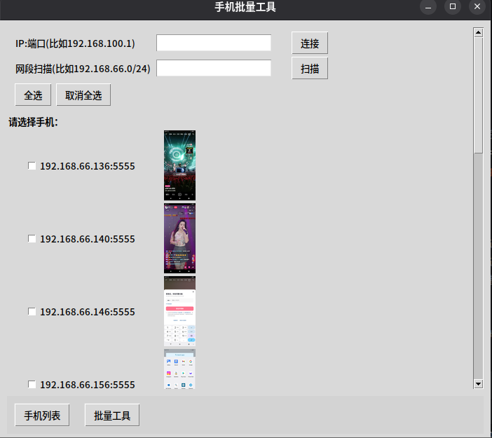
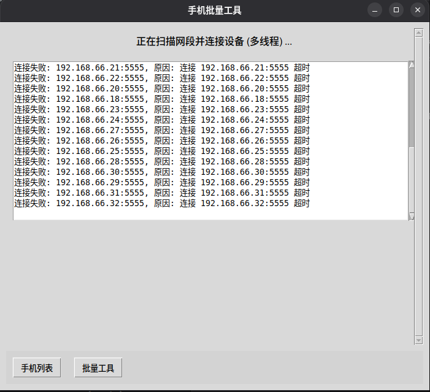
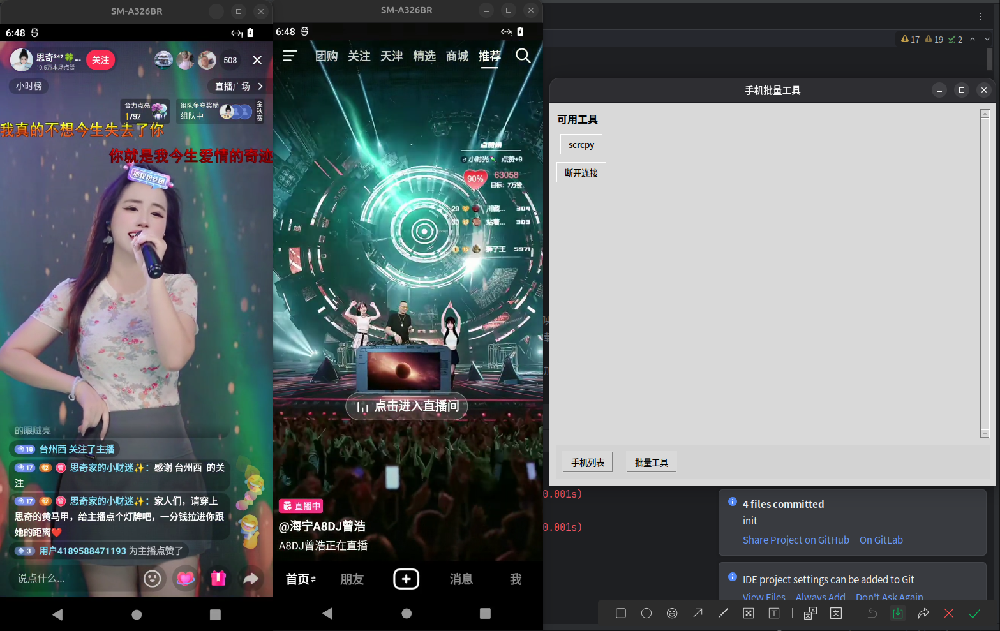

### Android Multi Control

#### Features

- Add a single '{ip:port}' mobile phone
- Scan the mobile phone under the specified network segment
- Use the 'scrcpy' connection

### 手机群控

#### 特性

- 添加单个`{ip:port}`的手机
- 扫描指定网段下的手机
- 使用`scrcpy`连接